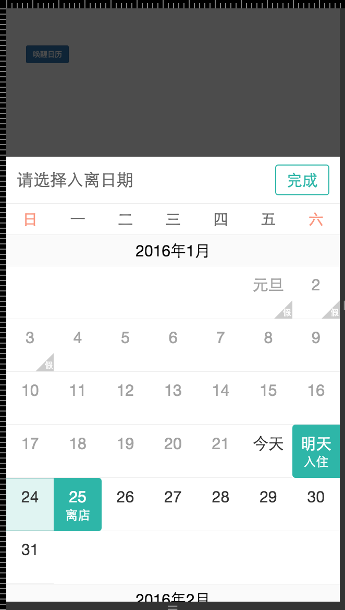

# vue-component-calendar

[](https://david-dm.org/vuejs/vue-loader-example)
[](https://david-dm.org/vuejs/vue-loader-example#info=devDependencies)

> Example using [vue-loader](https://github.com/vuejs/vue-loader) with [Webpack](http://webpack.github.io).

相关操作

```
# demo
双击打开`example/browser.html`

# serve with hot reload at localhost:8080 => 开发
npm run dev

# build for production with minification => 打包编译
npm run build

# prepub
gulp prepub

# publish
gulp publish
```

For detailed explanation on how things work, read the [docs for vue-laoder](http://vuejs.github.io/vue-loader).

### rem说明：

```
1rem = 100px(iPhone5)
1rem = 117.18px(iPhone6)

```

### API

* `max-date="4m"`

设置日历的最大展示日期，m代表月份，TODO：支持d

* `start-date="2016-01-23"`

设置日历默认选中的开始日期，此时默认是支持入住和离店 双选
* `end-date="2016-01-25"`

设置日历默认选中的离店日期

* `:is-double-check.sync=true`

日历是单选还是双选，文案不同，效果也不同

* `:is-vication.sync=true`

是否显示假期及假日


##相关截图

